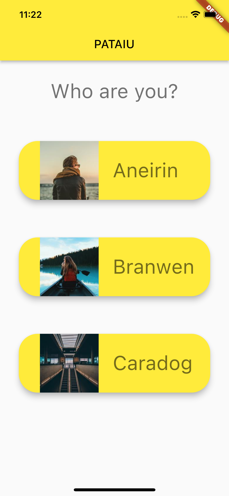

# People and their Abilitis in Use (PATAIU)

A tool to manage events requiring individuals with diverse skills and abilities.

>It is one of several projects which could solve real problems and get used by real users, but their real objective is to help me learn [dart](https://dart.dev) and [flutter](https://flutter.dev). The other projects are: [flow](https://github.com/michalporeba/flow), [stuffed](https://github.com/michalporeba/stuffed) and [ticks](https://github.com/michalporeba/stuffed). 

&nbsp;
## Problem domain

Sometime, to run an event one may need a group of suitably qualified individuals. Their training, qualifications and suitability have to managed. 

&nbsp;
## The result
So far it looks as unimpressive as this:

